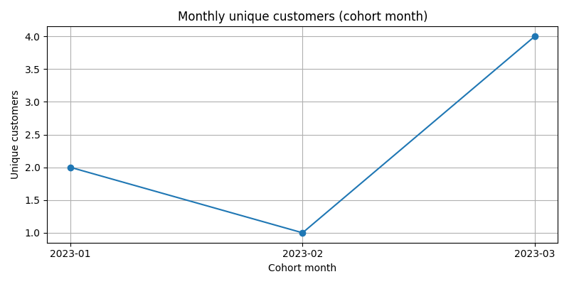
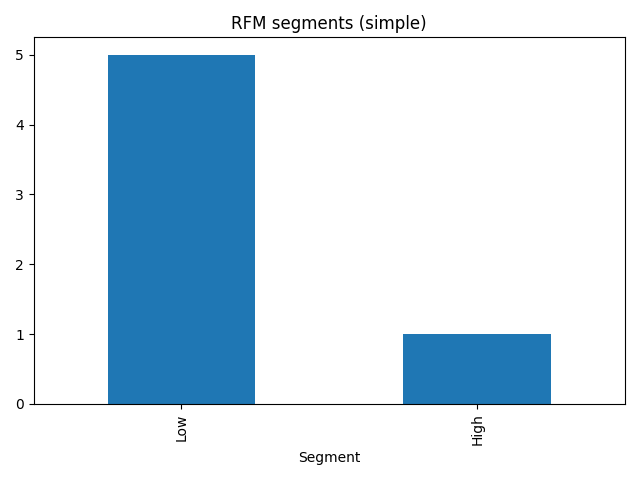
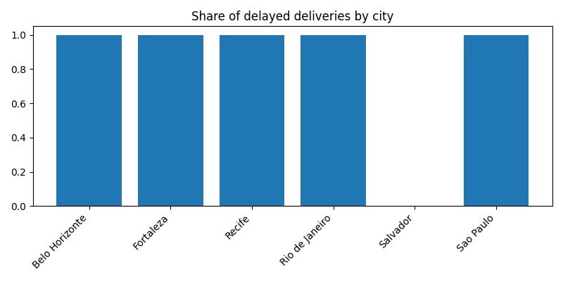

<!DOCTYPE html>
<html lang="ru">
<body>

<!-- Заголовок и бейджи -->

  <h1>🛒 Витрина продаж e-commerce и когортная аналитика</h1>
  
<b>Полноцикловый ETL-пайплайн обработки данных бразильского маркетплейса Olist</b>

  
  
  
  

<!-- Оглавление -->

  
<b>📌 Оглавление</b>

  <ol>
    <li><a href="#о-проекте">О проекте</a></li>
    <li><a href="#наша-команда">Наша Команда</a></li>
    <li><a href="#архитектура-пайплайна">Архитектура пайплайна</a></li>
    <li><a href="#функциональность">Функциональность</a></li>
    <li><a href="#скриншоты">Скриншоты</a></li>
    <li><a href="#технологический-стек">Технологический стек</a></li>
    <li><a href="#структура-проекта">Структура проекта</a></li>
    <li><a href="#быстрый-старт">Быстрый старт</a></li>
    <li><a href="#полная-документация">Полная документация</a></li>
    <li><a href="#развертывание">Развертывание</a></li>
  </ol>

<h2 id="о-проекте">📖 О проекте</h2>

  Цель проекта — построить воспроизводимый ETL-конвейер, который преобразует CSV-файлы Olist в структурированную SQLite-витрину 
  и позволяет проводить когортный анализ, RFM-сегментацию и анализ SLA доставки.

<b>Основные задачи:</b>

<ul>
  <li>ETL: загрузка, очистка и нормализация CSV данных</li>
  <li>Data Modeling: схема "Звезда" (fact_orders, dim_customer, dim_product и др.)</li>
  <li>Analytics: когортный анализ (Retention), RFM, SLA-доставка</li>
  <li>Quality: контроль качества данных на каждом этапе пайплайна</li>
</ul>

<b>Источник данных:</b> <a href="https://www.kaggle.com/datasets/olistbr/brazilian-ecommerce">Brazilian E-Commerce Public Dataset by Olist</a>.
  Датасет содержит реальные транзакции 2016–2018 годов. 
  Визуализации в проекте отражают эти временные диапазоны, поэтому оси времени могут не соответствовать текущему году (2026).

<h2 id="наша-команда">👥 Наша Команда</h2>
<table align="center">
  <tr>
    <td align="center"><b>Project Manager — Чернов Алексей</b></td>
    <td align="center"><b>Разработчик — Швыркунов Андрей</b></td>
    <td align="center"><b>QA / Аналитик — Калмыков Степан</b></td>
  </tr>
  <tr>
    <td align="center"> Планирование, спринты, управление рисками, отчётность</td>
    <td align="center"> Разработка ETL, работа с БД, Airflow DAG</td>
    <td align="center"> Тестирование, контроль качества, визуализация метрик</td>
  </tr>
</table>

<h2 id="архитектура-пайплайна">🏗 Архитектура пайплайна</h2>

Система построена по принципу <b>Medallion Architecture</b>:

<ol>
  <li><b>Bronze (Raw):</b> загрузка исходных CSV из Kaggle.</li>
  <li><b>Silver (Cleaned):</b> очистка, нормализация, дедупликация.</li>
  <li><b>Gold (Business):</b> создание fact/dim таблиц и аналитических витрин.</li>
</ol>

  

<h2 id="функциональность">🛠 Функциональность</h2>
<ul>
  <li><b>Моделирование данных:</b> схема "Звезда" (fact_orders, fact_order_items, dim_customer, dim_product, dim_calendar)</li>
  <li><b>Оркестрация:</b> DAG в Apache Airflow для автоматического запуска ETL</li>
  <li><b>Data Quality:</b> проверки PK, FK, диапазонов, уникальности и логики данных</li>
  <li><b>Аналитика:</b>
    <ul>
      <li>Когортный анализ удержания покупателей (M0→M1→M2)</li>
      <li>RFM-анализ (Recency, Frequency, Monetary)</li>
      <li>SLA-доставка:
        <ul>
          <li>Доля опоздавших заказов (Late Delivery Rate)</li>
          <li>Медианное время доставки по городам и категориям</li>
        </ul>
      </li>
    </ul>
  </li>
</ul>

<h2 id="скриншоты">📊 Скриншоты</h2>

  
<i>Когортный анализ</i>

  

  
<i>Продажи / RFM-анализ</i>

  

  
<i>SLA доставки</i>

  

<h2 id="технологический-стек">💻 Технологический стек</h2>

  <b>Storage:</b> SQLite  
  <b>ETL/Processing:</b> Python 3.11 (Pandas, SQLAlchemy)  
  <b>Orchestration:</b> Apache Airflow  
  <b>Quality Control:</b> встроенные проверки и unit-тесты  
  <b>Visualization:</b> Dash / Plotly

<h2 id="структура-проекта">📂 Структура проекта</h2>
<pre>
CityPulse/
├── src/
│   ├── etl/
│   │   ├── etl_pipeline.ipynb
│   │   ├── data_quality_checks.py
│   │   ├── sql_schema.sql
│   │   └── __init__.py
│   │
│   ├── analysis/
│   │   ├── cohort_analysis.ipynb
│   │   ├── rfm_analysis.ipynb
│   │   ├── sla_analysis.ipynb
│   │   └── dashboard_app.py
│   │
│   ├── airflow_dag/
│   │   └── ecommerce_etl_dag.py
│   │
│   └── __init__.py
│
├── data/
│   ├── raw/                    # Исходные CSV из Kaggle
│   ├── processed/              # Очищенные файлы
│   └── ecommerce.db            # SQLite база (локально)
│
├── docs/
│   ├── dashboard_cohort.png
│   ├── dashboard_rfm.png
│   ├── dashboard_sla.png
│   ├── pipeline_flow.png
│   ├── README.md
│   ├── ARCHITECTURE.md
│   ├── DATA_README.md
│   ├── TESTING.md
│   ├── CLEANING_RULES.md
│   └── REPORT.md
│
├── requirements.txt
├── .gitignore
└── README.md
</pre>

<h2 id="быстрый-старт">🚀 Быстрый старт</h2>
<ol>
  <li>Склонируйте репозиторий.</li>
  <li>Создайте виртуальное окружение и установите зависимости:
    <pre><code>python -m venv .venv
.venv\Scripts\activate
pip install -r requirements.txt</code></pre>
  </li>
  <li>Поместите CSV-файлы Olist в <code>data/raw/</code>.</li>
  <li>Запустите ETL DAG через Airflow или отдельные скрипты Python.</li>
  <li>Для визуализации:
    <pre><code>python src/analysis/dashboard_app.py</code></pre>
  </li>
</ol>

<h2 id="полная-документация">📖 Полная документация</h2>

  
<b>Методология очистки, контроль качества и метрики</b>

  <ul>
    <li><b>Дедупликация:</b> сопоставление клиентов по email и zip_code</li>
    <li><b>Аномалии:</b> фильтрация заказов с некорректными ценами и сроками доставки</li>
    <li><b>Контроль качества данных:</b>
      <ul>
        <li>Уникальность первичных ключей (PK)</li>
        <li>Целостность внешних ключей (FK)</li>
        <li>Проверка диапазонов числовых значений (цены, фрахт, вес)</li>
      </ul>
    </li>
    <li><b>Метрики:</b>
      <ul>
        <li>GMV (Gross Merchandise Volume)</li>
        <li>AOV (Average Order Value)</li>
        <li>Late Delivery Rate</li>
      </ul>
    </li>
  </ul>

<h2 id="развертывание">🌐 Развертывание</h2>

  Проект можно запускать локально через Python или в Docker Compose.
  Для учебной демонстрации достаточно ноутбуков и запуска скриптов вручную.

  <b>Проект выполнен в рамках учебного задания по предмету Технология хранения и обработки больших объёмов данных / Analytics, 2026.</b>

</body>
</html>
